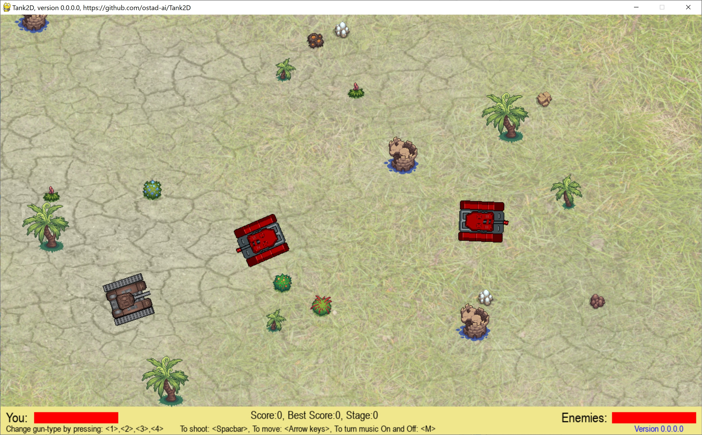

# Tank2D
This is a 2D combat game in which you can control a tank to shoot the enemies.
### First version: version 0.0.0.0
1. Use **Arrow keys** to move the tank.
2. To shoot bullets, you employ the **SpaceBar** key.
3. To change the gun-type, use keys: **1**, **2**, **3**, and **4**.
4. Background music is also included, which you can turn it ON or OFF by key **M**.
## This archive includes the executable program: **tank2d.exe**, which is suitable for **Windows 10** and over. You should click on the executable to run.
[Download the archive for win64](https://drive.google.com/file/d/1M5AOgUoqpm1Xf97S2wtYCnikiiOgwLGa/view?usp=sharing)
---
 *Figure 1: A snapshot of Tank2D Game, version 0.0.0.0, while playing the game.*
---
